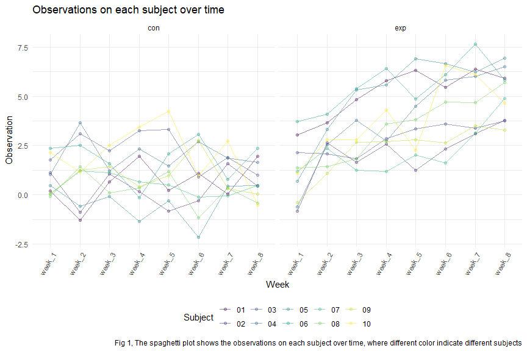

p8105_hw5_ps3395
================
Peng Su
2023-11-12

# Problem 1

# Problem 2

### Create a tidy dataframe

Writing functions to import all data and tidy the data.

``` r
# get all data file names

file_names = 
  tibble(names = list.files("./data")) |>
  mutate(
    names = paste("./data", names, sep = "/")
  )

# read in the data for all subject

import = function(file_names) {

    read_csv(file_names) |>
    mutate(
      file_names = file_names
    )
}

# tidy the data

longitudinal_df = 
  bind_rows(map(file_names, import)) |>
  mutate(
    file_names = sub("^./data/", "", file_names),
    file_names = sub(".csv$", "", file_names)
  ) |>
  separate(file_names, into = c("arm","subject_ID"),sep = "_") |>
  pivot_longer(
    week_1:week_8,
    names_to = "time",
    values_to = "observation"
  ) |>
  select(subject_ID, everything()) |>
  janitor::clean_names()
```

### spaghetti plot

``` r
# spaghetti plot

longitudinal_df |>
  group_by(subject_id) |>
  ggplot(aes(x = time, 
             y = observation, 
             group = as.factor(subject_id),
             color = as.factor(subject_id))) +
  geom_point(alpha = 0.3)+
  geom_line(alpha = 0.5)+
  facet_grid(. ~ arm) +
  labs(x = "Week", 
       y = "Observation",
       title = "Observations on each subject over time",
       caption = "Fig 1, The spaghetti plot shows the observations on each subject over time, where different color indicate different subjects",
       color = "Subject"
       ) +
  theme(axis.text.x = element_text(angle = 60, hjust = 1))
```



The spaghetti plot displayed the observations on each subject over time,
from Fig 1, it can be noticed that participants’ observation data in the
experimental arm and the control arm had small within-group differences,
which the data fluctuated in a similar range. However, significant
inter-group differences could be seen by comparing the experimental arm
and the control arm. The observed data of the experimental group showed
an overall increasing trend over time, while the data of the control
group showed a relatively stable change.
